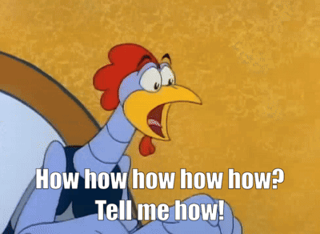

# Introduction 
This folder/repo has been set up to rel-learn some of the skills i have either lost, or has faded over time in which i want to re-scratch up on.
## The Goal 

to relearn ML skills, but also prep and learn GENAI stuff from scratch to build some beautiful things hopefully 😁 
- Read ML for dummies from beginning to end to and use examples to learn with here 
- Artificial  Intelligence for dummies 
- Facts from Figures by M.J.Moroney - Covering stats from scratch and from the ground up and document them here.

## Why am I doing this ?

A few reasons really, but mainly to prove to myself that I can get back on the horse of Data Science , Machine Learning as well as learn some new skills in Generative AI I have been nervous to try once the former has been caught up with. 
Also a reminder to myself (and hopefully this helps others!) That its okay to fall off the wagon in this space and to get back on the horse again as it were, we all have roadblocks or simply... life gets in the way!
And with tech that has seemed to advance at a exponential speed, sometimes relearning the basics is a good thing and can give you the building blocks to learn to a higher level. 

Personally, after experiencing a cancer scare, and being cheated on by the first boy i ever really loved at the same whilst getting treatment (and boy isn't grief and heartbreak a horrible thing!), not only did i lose my mojo and confidence in many ways ,and my mind not being in the best place , but lost my love for data for some time. Its not the data's fault, nor my own really. The point im trying to make with this is that, I am trying to re-learn the knowledge I know is stuck in my noggin, it just needs a little nudge to come back out again :) , and if this helps anyone else grow and learn into a more beautiful human being with data - especially if they have similar experiences too-  then that'll make me smile 💗.

# So , how am i doing this ?

Well, I think I have a plan in my head to split the goal across three folders under this repo:
1. Facts from Figures By MJ.Moroney 
A Book I cherish from the 1950's which helped me a lot learning stats that i struggled elsewhere to learn . Stats is not something I naturally am skilled at , so its a way to re-hash what i already know but to explain it with practical examples as well as properly understand the things i have yet to fully bolster my knowledge of. not only to learn whilst writing , but to make a reference piece in its own right 😊.

2. ML for dummies 
Hey these books are good so no regrets !! should be able to help me re-learn some of the methods of ML modelling that i have lost and learn something new along the way 😉

3. Artificial Intelligence for Dummies
This i think gives a general over of AI , but is updated to cover general topics of ML and GenAI , so will give a good jumping off point for some ideas and project to try out hopefully 🤞